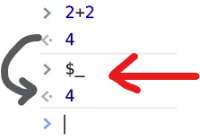

# 43-5 More devtool features performance, memory, security

### Element

### Console

### Sources

### Network

### Application

### dev tools tip and trick
1. [21+ Browser Dev Tools & Tips You Need To Know](https://youtu.be/TcTSqhpm80Y)

    -   ```javascript
            document.designMode = 'on'
        ```

    -   screenshot
        ```   javascript
            ctrl + p 
            type screenshop
        ```

    -   Visual Coverage
        ```   javascript
            1. go to sources tab then click the coverage 
        ```
        
        
2. [How to speed up your workflow with Console shortcuts](https://youtu.be/hdRDTj6ObiE)

    -   can you customize website design extension
        

    -   find the previous value in the console
        
        