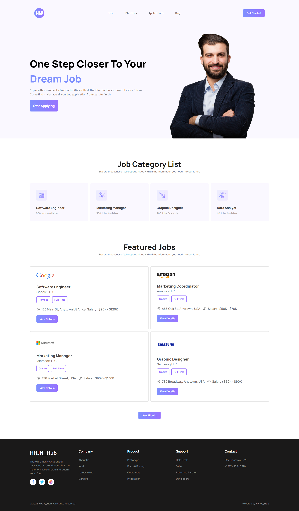

# HHJN_HUB

## Whatever was used to build the app

## Live Link - [Click ME](https://6435d1a517f1e2005b2faee0--peppy-blini-8b5ac7.netlify.app/)

## Code Link - [Click ME](https://github.com/Porgramming-Hero-web-course/b7a9-career-hub-Tahsin000)

1. React vite

   - installation

   ```jsx
   npm create vite@latest

   cd my-project

   npm install
   npm run dev
   ```

2. React router dom

   - installation

   ```jsx
   npm install react-router-dom localforage match-sorter sort-by
   ```

3. Tailwindcss

   - installation

   ```jsx
    npm install -D tailwindcss postcss autoprefixer
    npx tailwindcss init -p
   ```

   - index.css

   ```jsx
    @tailwind base;
    @tailwind components;
    @tailwind utilities;
   ```

4. Recharts
   - installation
   ```jsx
    npm install recharts
   ```
5. AOS

   - installation

   ```jsx
    bower install aos --save
   ```

   - css link

   ```css
   <link rel="stylesheet" href="bower_components/aos/dist/aos.css" />
   ```

   - script link

   ```javascript
   <link rel="stylesheet" href="bower_components/aos/dist/aos.css" />
   ```

   - Init AOS

   ```javascript
   <script>AOS.init();</script>
   ```

6. Toastify

   - installation

   ```jsx
   npm i react-toastify
   ```

   Init Toastify

   ```jsx
   toast("🦄 Wow so easy!", {
     position: "top-right",
     autoClose: 5000,
     hideProgressBar: false,
     closeOnClick: true,
     pauseOnHover: true,
     draggable: true,
     progress: undefined,
     theme: "light",
   });
   ```

7. heroicons
   - installation
   ```jsx
   npm install @heroicons/react
   ```
   - Init heroicons
   ```jsx
   import { BeakerIcon } from "@heroicons/react/24/solid";
   function MyComponent() {
     return (
       <div>
         <BeakerIcon className="h-6 w-6 text-blue-500" />
         <p>...</p>
       </div>
     );
   }
   ```

## Component Tree

- AppliedJob
  - AppliedJob.jsx
- AppliedJobs
  - AppliedJobs.jsx
- Blog
  - Blog.jsx
- CategoryJob
  - CategoryJob.jsx
- CategoryJobs
  - CategoryJobs.jsx
- ErrorPage
  - ErrorPage.jsc
- FeaturedJob
  - FeaturedJob.jsc
- FeaturedJobs
  - FeaturedJobs.jsx
- Footer
  - Footer.jsx
- Home
  - Home.jsx
- JobDetails
  - JobDetails.jsx
- Nav
  - Nav.jsx
- Statistics
  - Statistics.jsx
- Utilities
  - fakeDB.js

<div style="text-align:center">

## Desktop UI



## Mobile UI


</div>
