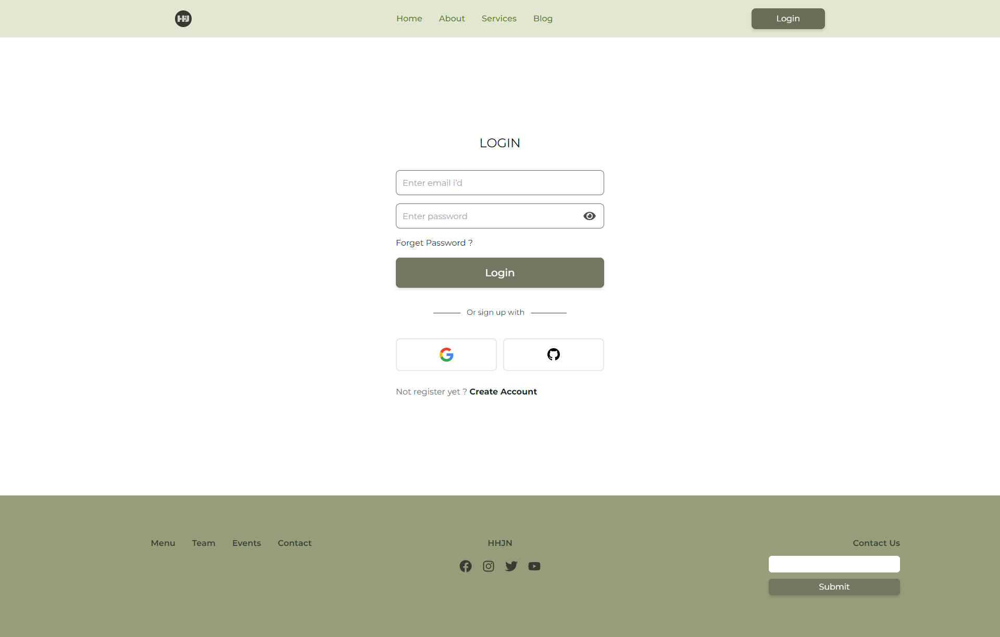

# HHJN-RESTAURANTS

## client-side code: [Click ME](https://github.com/programming-hero-web-course-4/b7a10-chef-recipe-hunter-client-side-Tahsin000)

## server-side code: [Click ME](https://github.com/programming-hero-web-course-4/b7a10-chef-recipe-hunter-server-side-Tahsin000/tree/main/my-app-server)

## Live view: [Click ME](https://hhjn-restaurants.netlify.app/)

<hr/>

## Whatever was used to create the project

- ## reace vite
  ```jsx
  npm create vite@latest name-of-your-project -- --template react
  ```
- ## reace vite
  ```jsx
  npm install react-router-dom localforage match-sorter sort-by
  ```
- ## tailwindcss

  ```jsx
  npm install -D tailwindcss
  npx tailwindcss init

   content: ["./src/**/*.{html,js}"],

  @tailwind base;
  @tailwind components;
  @tailwind utilities;

  ```

- ## tailwindcss

  ```jsx
  npm install -D tailwindcss
  npx tailwindcss init

   content: ["./src/**/*.{html,js}"],

  @tailwind base;
  @tailwind components;
  @tailwind utilities;
  ```

- ## Swiper
  ```jsx
  npm i swiper
  ```
- ## react toast
  ```jsx
  npm i react-toastify
  ```
- ## Firebase
  ```jsx
  npm i firebase
  ```
- ## vercel
  ```jsx
  vercel;
  ```
- ## Express
  ```jsx
  npm i express
  ```
- ## AOS
  ```jsx
  npm i aos
  ```

# UI



