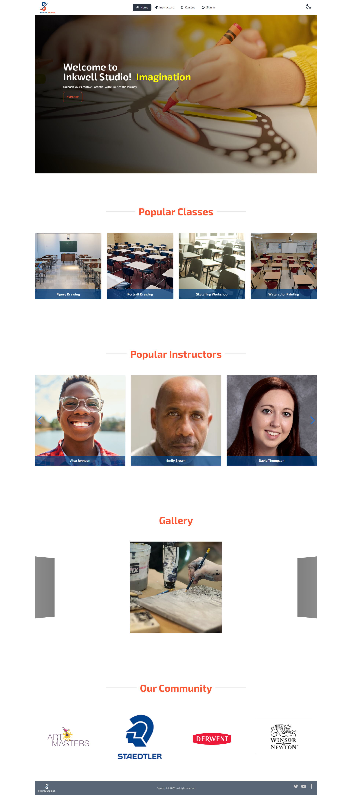
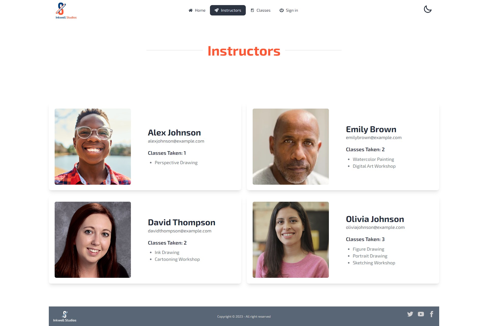
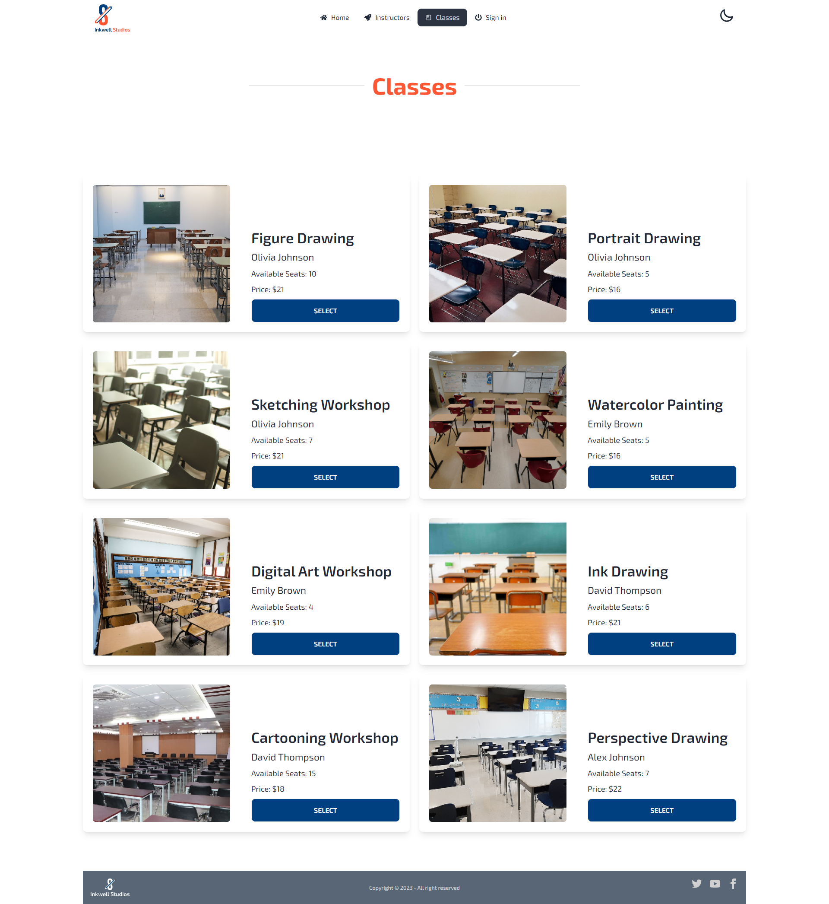
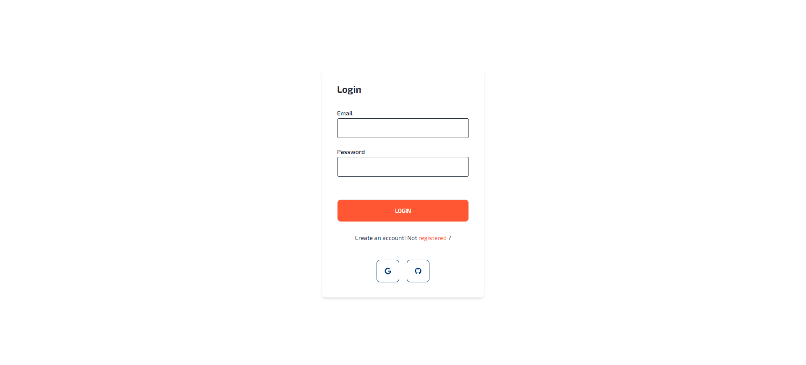
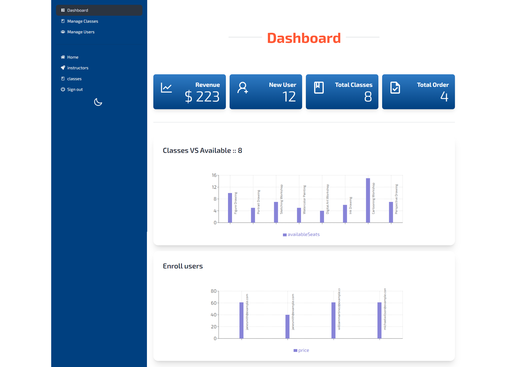
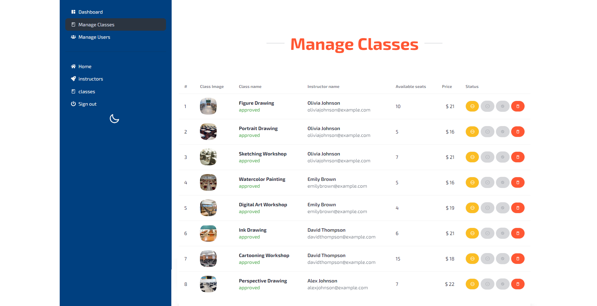
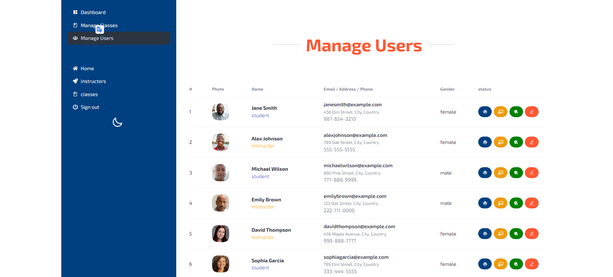

# SUMMER CAMP CLIENT

## [Client-side code GitHub repository](https://github.com/programming-hero-web-course1/b712-summer-camp-client-side-Tahsin000)

## [Server-side code GitHub repository](https://github.com/programming-hero-web-course1/b7a12-summer-camp-server_side-Tahsin000)

## [Live website link](https://summer-camp-client-ded4c.web.app/)

## Admin email and password

- **Email:** johndoe@example.com
- **Password:** 123123

## Instructor email and password

- **Email:** alexjohnson@example.com
- **Password:** 123123

## Student email and password

- **Email:** janesmith@example.com
- **Password:** 123123

## Packages

1. react-stripe-js
2. stripe-js
3. tanstack/react-query
4. axios
5. firebase
6. react-dom
7. react-helmet-async
8. react-hook-form
9. react-icons
10. react-router-dom
11. react-scroll
12. react-simple-typewriter
13. react-toastify
14. recharts
15. sort-by
16. sweetalert2
17. swiper

## UI

### Home Page

### instructors Page

### classes Page

### Sign in Page

### Admin dashboard Page

### Manage Classes Page

### Manage Users Page

