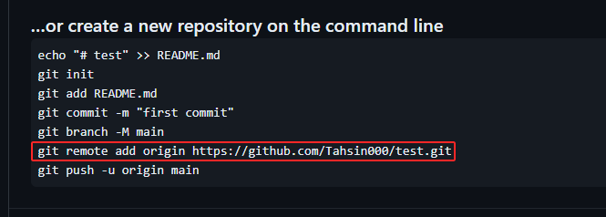

# 82_5-3 move private assignment repository to your public repo

## git repo version check

``` git
git remote -V
```
## Setting your own repo version
1. make new repo 
2. copy this url portion 
3. change add to replace set-url
``` git
git remote set-url origin https://github.com/Tahsin000/test.git
```