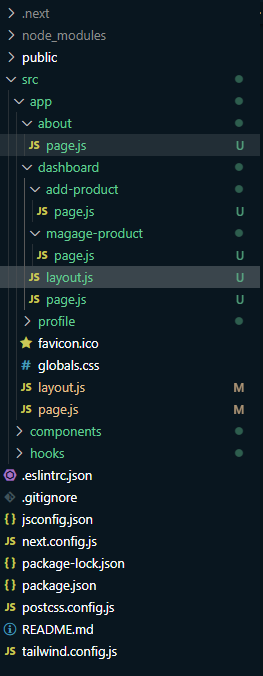

# 83-4 Routing, nested routing and metadata

## Metadata

```js
export const metadata = {
  title: "Dashboard | Next Hero",
  description: "Next Hero",
};
```

## Layout

```js
import React from "react";

export const metadata = {
  title: "Dashboard | Next Hero",
  description: "Next Hero",
};

const DashboardLayout = ({ children }) => {
  return (
    <div>
      Side_bar
      {children}
    </div>
  );
};

export default DashboardLayout;
```

## Routing Setup


