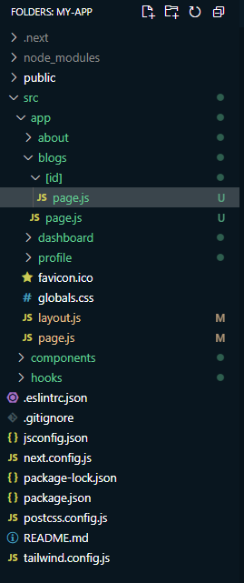
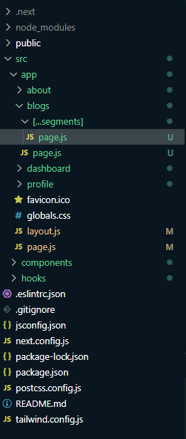

# 83-5 Dynamic routes, catch-all Segments and template

## dynamic routing

1. first make a folder | The naming convention is `[]`
   
    ```js
    import React from 'react';
    const page = () => {
        return (
            <div>
                This is the blogs page
            </div>
        );
    };
    export default page;
    ```

## catch hold routing

1. The naming convention is `[...YOUR_ROUTE_NAME]`
   
    ```js
    const SingleBlog = ({params}) => {
        const [year , id] = params.segments;

        return (
            <div>
                Single Blogs {year} for {id}
            </div>
        );
    };

    export default SingleBlog;
    ```
