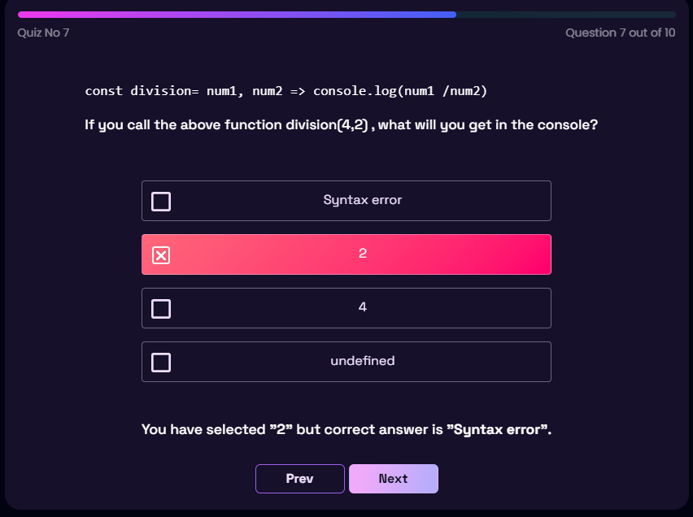
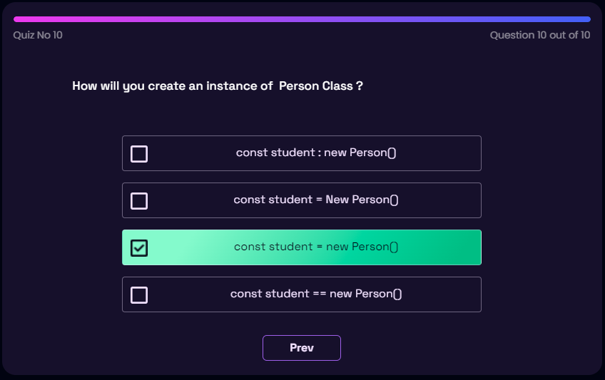
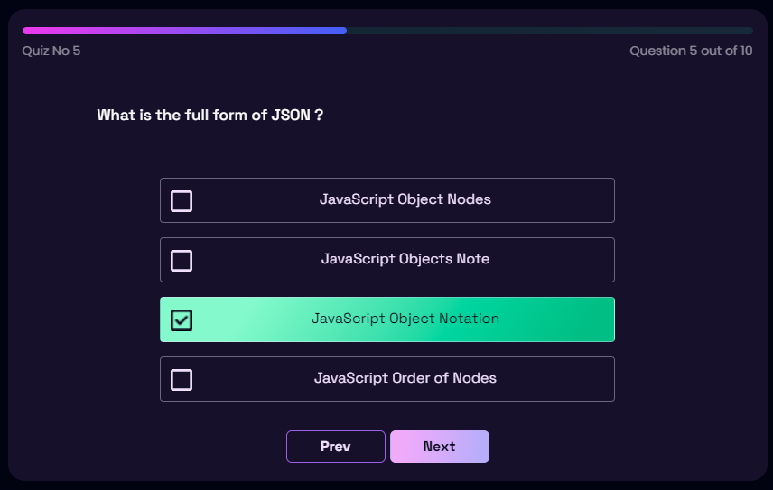
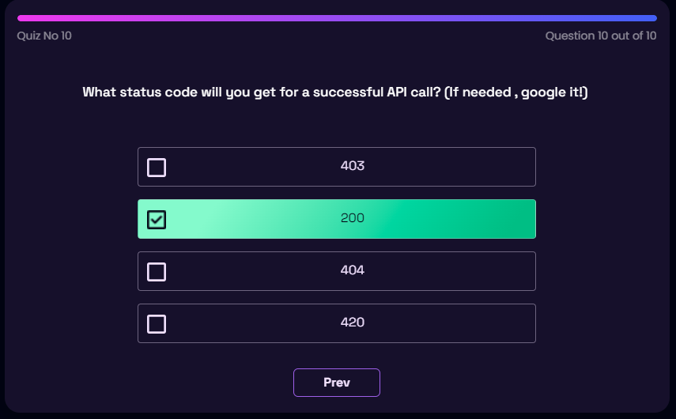
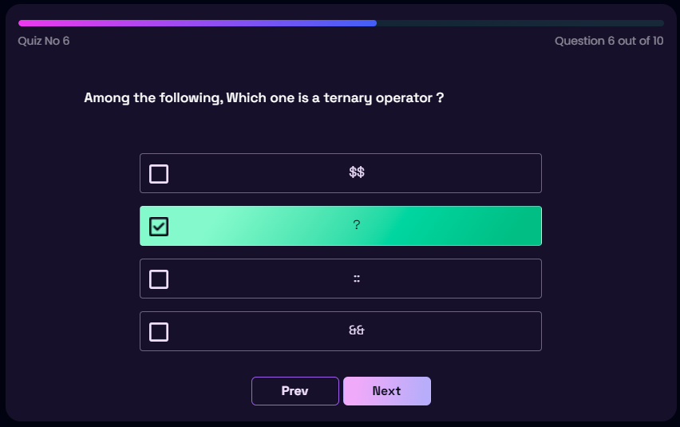
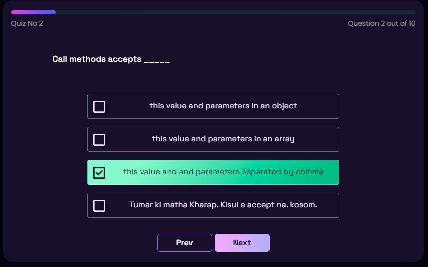
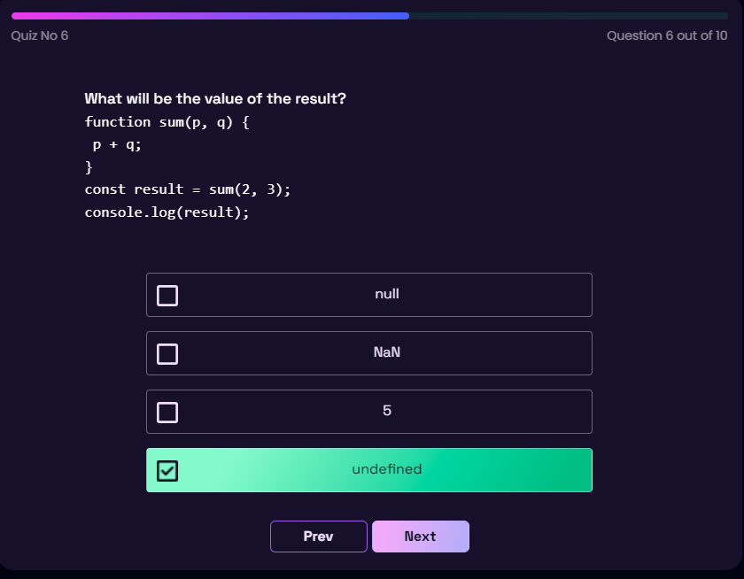

# Quiz-31 [Module 31: JS Recap and Basic ES6, ES2015]

# Quiz-32 [Module 32: (advanced) ES6, Class, Inheritance]

# Quiz-33 [Module 33: API, JSON, Data load, dynamic website]

# Quiz-34 [Module 34: API Examples and edge cases]

# Quiz-35 [Module 35: API Recap with Phone hunter]

# Quiz-36 [Module 36: (advanced) Mastering in JS Objects]

# Quiz-37 [Module 37: Understand Common JavaScript Concepts]

